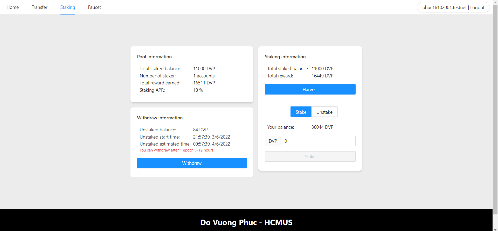

# DVP Application Frontend

## Introduction

Blockchain technologies are very hard and require a high technical skill to use. Because of that reason, to become user-friendly, frontend UI is important. This is a repository of a website that provides usability on a token called DVP (Do Vuong Phuc) with different features:

- **View information:** view tokens's metadata such as icon, symbol, name and balance of current user
- **Faucet:** Withdraw tokens with a limit amount (test-purpose)
- **Transfer:** Send tokens to the other users
- **Staking:** Deposit token and receive reward after some interval of time

## Gallery

  

    <b>Staking view</b>

## Code exploration
The application builds with ReactJS framework with the structure as following:
- `components`: The components which are used on pages
- `pages`: The pages of application
- `utils`: The utility services for interact with contracts

## Smart contracts
In the application, I have used several relative smart contracts:
- [Fungible token](https://github.com/phuc16102001/near-dvp-ft)
- [Faucet contract](https://github.com/phuc16102001/near-dvp-faucet)
- [Staking contract](https://github.com/phuc16102001/near-dvp-staking)

## Contributions
This source code is owned by Do Vuong Phuc, please **DO NOT COPY** without permission!